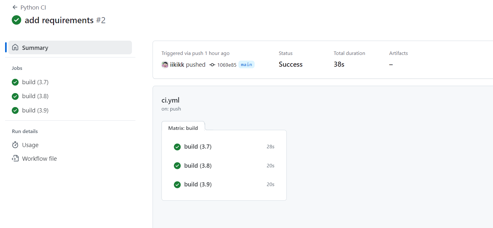

# Project Name: Python CI with GitHub Actions

This repository demonstrates the setup and use of GitHub Actions to perform continuous integration across multiple Python versions using a matrix strategy. It contains a Python script that analyzes data from an Excel file and outputs summary statistics.

## CI Badge

[](https://github.com/iikikk/Actions-Matrix-Build/actions/workflows/ci.yml)

## Features

- **Python Script**: Analyzes data and prints summary statistics.
- **GitHub Actions CI**: Runs tests across Python versions 3.7, 3.8, and 3.9.
- **Excel Data Processing**: Reads and processes data from an Excel file using `pandas`.

### Prerequisites

What you need to install the software:

- Python (3.7, 3.8, 3.9)
- Git
- Pip

### Installing

A step-by-step series of examples that tell you how to get a development environment running:

### Running the tests

Explain how to run the automated tests for this system:

```bash
pytest
```

## GitHub Actions CI

This project uses GitHub Actions for continuous integration. Upon every push or pull request, the CI workflow runs the script across multiple versions of Python to ensure compatibility and correct functionality.

## CI Success Image


### Workflow

The CI workflow does the following:

- Sets up a Python environment.
- Installs dependencies.
- Runs the Python script.

## Built With

- [Python](https://www.python.org/) - The scripting language used.
- [Pandas](https://pandas.pydata.org/) - Library for data manipulation and analysis.
- [Matplotlib](https://matplotlib.org/) - Library for creating static, interactive, and animated visualizations in Python.
- [Seaborn](https://seaborn.pydata.org/) - Statistical data visualization library based on matplotlib.
